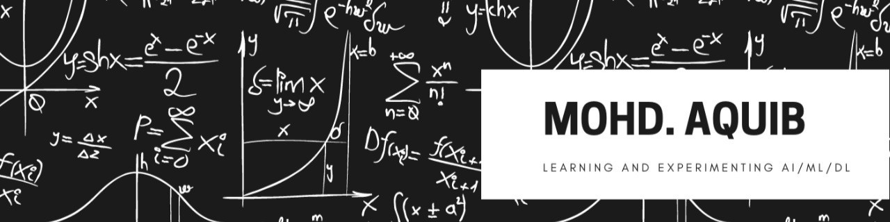

<h1> Hello Fellow < Developers/ >!  </h1>
<h2> Hi! My name is Mohd Aquib. Thank You for taking the time to view my GitHub Profile.</h2>

<h2> About Me </h2>

- 🔭 I’m currently working as a Data Scientist in Extreme Networks

- 🌱 I’m currently learning Generative AI 

- 👯 I’m looking to collaborate on Projects, Tech Articles 

- 💬 Talk to me about Python, Machine Learning, Deep Learning, LLMs, Generative AI 

  

## Blogs posts

<h2> Skills  </h2>

<h2> Connect with me  </h2>
 
 
 
 

<h2> Stuff I worked on   </h2>

 

# Most Language Used
  

 
# My GitHub Stats
 

### ✍️ Random Dev Quote

### 😂 Random Dev Meme

 
   
   
  
   

